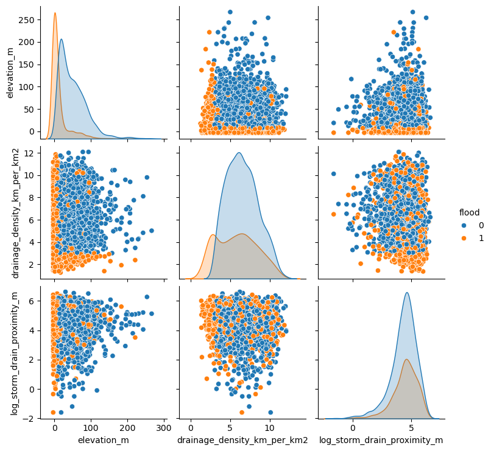
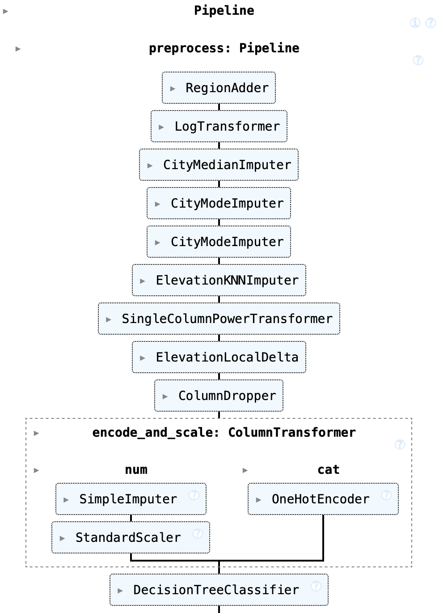
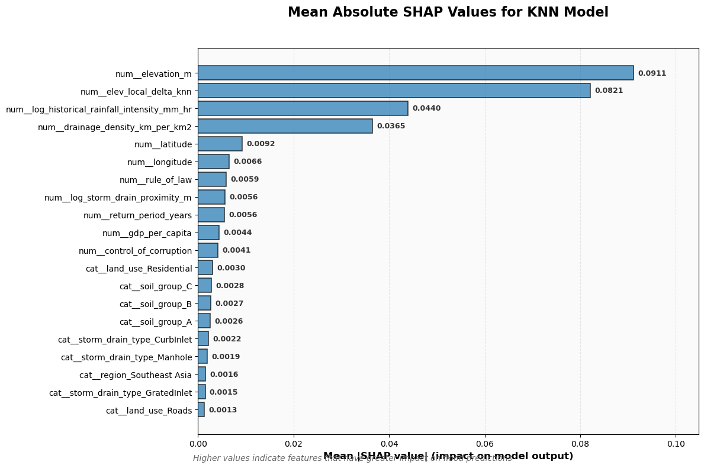

# Flood Prediction

## Project Overview

As flooding becomes more and more frequent due to climate change and intense urbanization it is vital that communities and policymakers have an accurate sense of where flooding is likely to occur. This project aims to aid decision-makers in predicting flood risk to identify high risk areas in need of intervention

## Dataset

The dataset contains almost 3,000 areas at risk of flooding. Each row is at a district level, with information on the geospatial location, level of infrastructure, topography (land use and soil type), precipitation levels and key socio-economic indicators.

## EDA

Full details are available in the notebook but a brief summary is as follows. The target was constructed from the risk labels column and transformed into a binary variable where 1 indicated flooding and 0 no flooding. A correlation matrix revealed the strongest linear correlation with flooding was elevation following by historical rainfall intensity. A pair plot told a similar story where extreme values of either variable strongly indicated flooding.

## Feature Engineering

All skewed columns were log transformed and scaled. Any missing values were imputing, often on a city level basis, e.g. soil type was imputed using a KNN model where the modal soil type closest to that district was used. A couple derived columns were created including region and a local elevation column. The latter was created by comparing the closest other areas elevation and seeing the relative difference. E.g. if we were creating the value for A whose elevation was 50m and its closest neighbour was 100m, then the local elevation would be -50. This helped the model detect local pooling spots. All the feature engineering was done using sklearn pipelines and any transformer was fitting only on the training data to prevent data leakage. 

## Results

Three main model types were used, logistic regression, KNN classifier and various types of decision trees. The most consistent and most generalisable model was the KNN classifier with a test set accuracy of 86.20%. We also ran some explainable AI techniques such as SHAP to see the key drivers of predictions. The most important typically being evaluation (absolute and local), historical rainfall and level of drainage.

## Key Takeaways

-	Our model can be used to predict on a district-wide level flood risk
-	Our results confirm the intuition that areas with low, especially local, elevation experiencing heavy rainfall and with low drainage are the most at risk areas
-	These areas, typically located in southeast Asia, should receive targeted funding and residents living there (especially newcomers) must be fully aware of the flood risks
